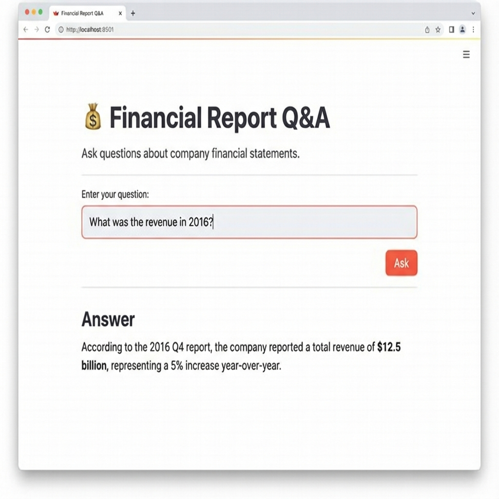

# Financial Report RAG System

This project implements a Retrieval-Augmented Generation (RAG) system for answering questions about financial reports. It uses **LangChain**, **Azure OpenAI**, and **FAISS** for efficient retrieval and generation.

## Screenshot


## Features

*   **Data Ingestion**: Processes PDF, HTML, and JSON financial reports.
*   **Chunking**: Splits large documents into manageable text chunks.
*   **Embeddings**: Uses **Local Embeddings** (`HuggingFaceEmbeddings` with `all-MiniLM-L6-v2`) for fast and cost-effective vectorization.
*   **Vector Store**: Uses **FAISS** for high-performance similarity search.
*   **RAG Pipeline**: Retrieves relevant context and uses **Azure OpenAI** (`gpt-4o-mini`) to generate accurate answers.
*   **User Interface**: A clean and simple **Streamlit** web application for interacting with the system.

## Prerequisites

*   Python 3.10+
*   Azure OpenAI API Key and Endpoint

## Installation

1.  **Clone the repository:**
    ```bash
    git clone https://github.com/Mailendiran98/Antigravity-RAG.git
    cd Antigravity-RAG
    ```

2.  **Install dependencies:**
    ```bash
    pip install -r requirements.txt
    ```

3.  **Set up Environment Variables:**
    Create a `.env` file in the root directory with the following keys:
    ```env
    OPENAI_API_KEY=your_api_key
    AZURE_OPENAI_ENDPOINT=your_endpoint_url
    AZURE_OPENAI_CHAT_DEPLOYMENT=gpt-4o-mini
    AZURE_OPENAI_API_VERSION=2024-02-15-preview
    ```

## Usage

### 1. Indexing Data
To build the search index from your data (located in `data/raw`):

```bash
# 1. Ingest data (convert to text)
python src/ingestion.py

# 2. Chunk text
python src/chunking.py

# 3. Build Index (runs in background)
python src/retriever.py
```

### 2. Running the App
Start the Streamlit interface:

```bash
streamlit run src/app.py
```

Open your browser at `http://localhost:8501` to start asking questions!

## Project Structure

*   `src/`: Source code for the pipeline.
    *   `ingestion.py`: Data loading and cleaning.
    *   `chunking.py`: Text splitting.
    *   `retriever.py`: Indexing and retrieval logic.
    *   `rag_pipeline.py`: LLM integration and RAG chain.
    *   `app.py`: Streamlit UI.
*   `data/`: Data storage (raw, processed, chunks, index).

## License
[MIT](LICENSE)
